# StreamIT
Media Player app with advance playback features using Exoplayer

ExoPlayer is an open-source media player library for Android developed by Google. ExoPlayer is designed to be flexible and extensible, with support for a wide variety of audio and video formats, as well as advanced playback features such as adaptive streaming, seamless looping, and dynamic bitrates. It also provides a simple API for controlling playback and monitoring playback events, making it easy to integrate into your Android application.

ExoPlayer is also highly customizable, with support for custom renderers, audio and video codecs, and track selection strategies. This allows developers to tailor the player to their specific needs and optimize playback performance for their particular use case.

Overall, ExoPlayer is a powerful and flexible media player library for Android, and is widely used by developers and organizations to provide high-quality media playback in their Android applications.

This app supports all the popular video formats including MKV, MP4 , 3GP, M4V, MOV, MTS, TS, FLV, WEBM etc.

It can show videos in folders as well as without folders in a separate section. It provides the best equalizer for managing audio track frequencies.

## ✨ StreamIT app features

- Bass Boost Equailzer
- Zoom in / Zoom out
- Plays all the popular video formats smoothly
- Full HD video player with 1080p resolution
- Swipe for volume and brightness change
- Support Subtitles
- Manage Playback Speed of Video
- Picture in Picture mode for playing video in small window
- Double Tap to Play Pause
- Night Mode
- Section for showing all videos of device
- Properties of video (video name, path, size, length, duration, resolution)
- Share Videos with friends
- Search Video with Name
- Lock and unLock video
- Scaling (Fullscreen, Zoom, Fit)
- Play next previous video
- Sort Video files by name, date, length and size in Ascending or Descending order

## 🖼️ Screenshot

  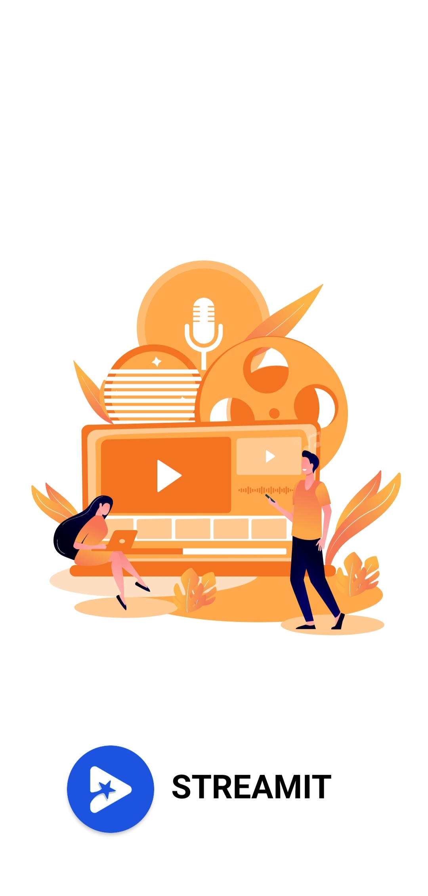
  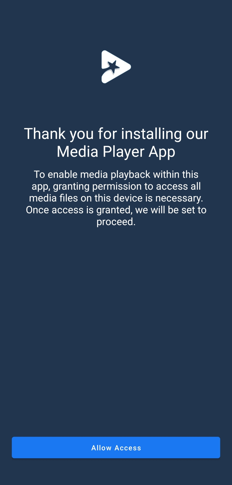
  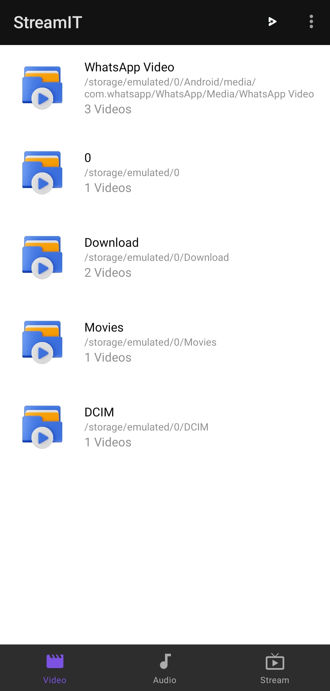
  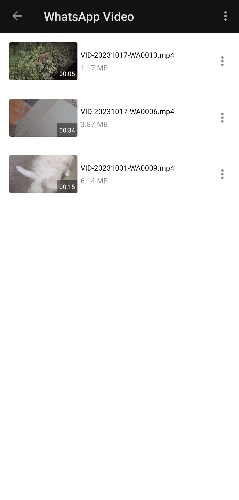

  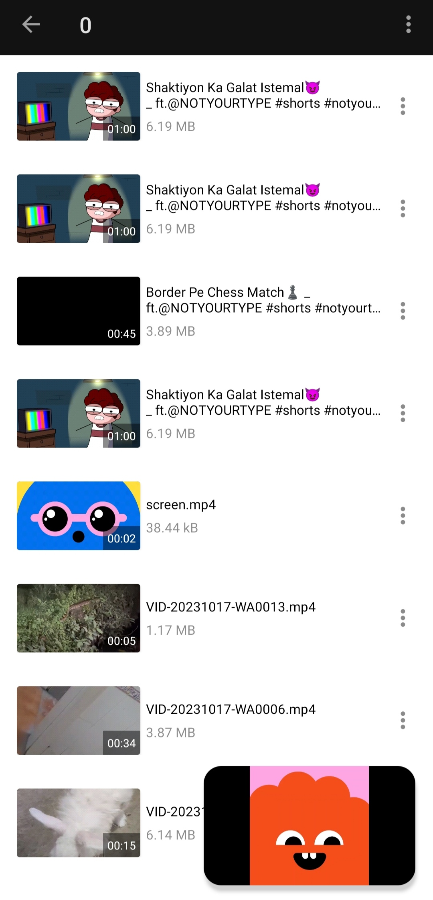
  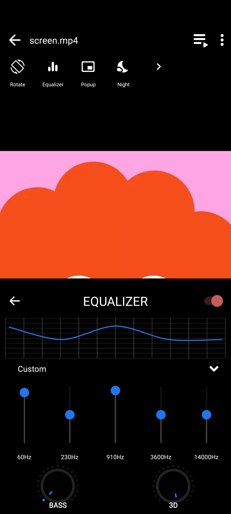
  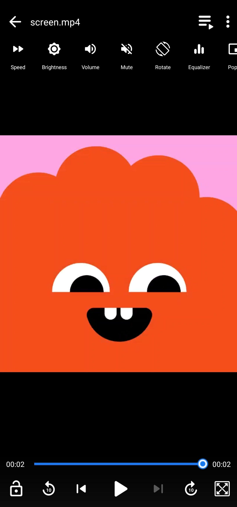
  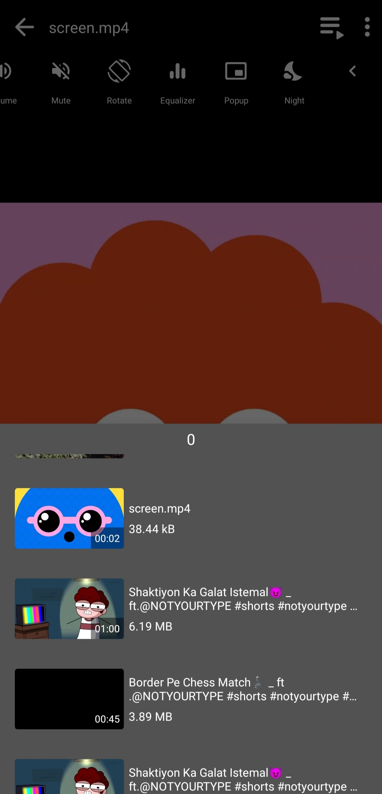

  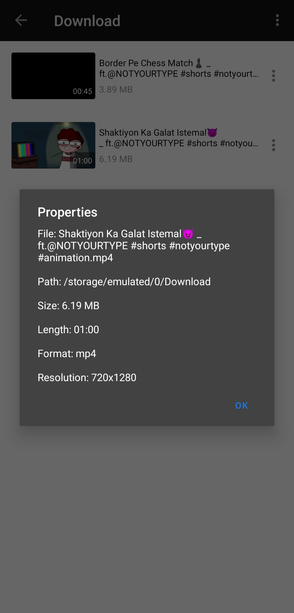
  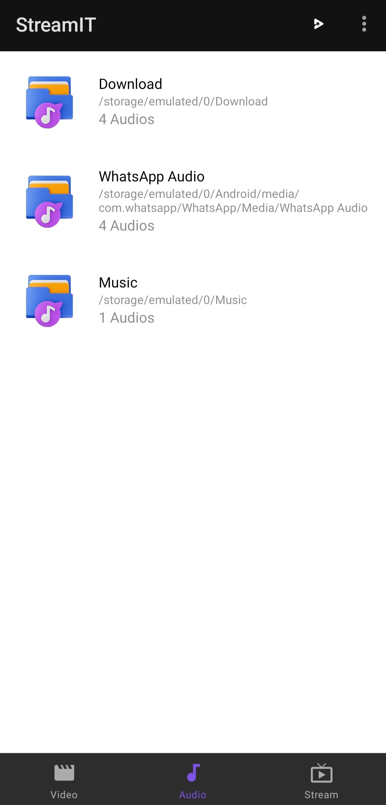
  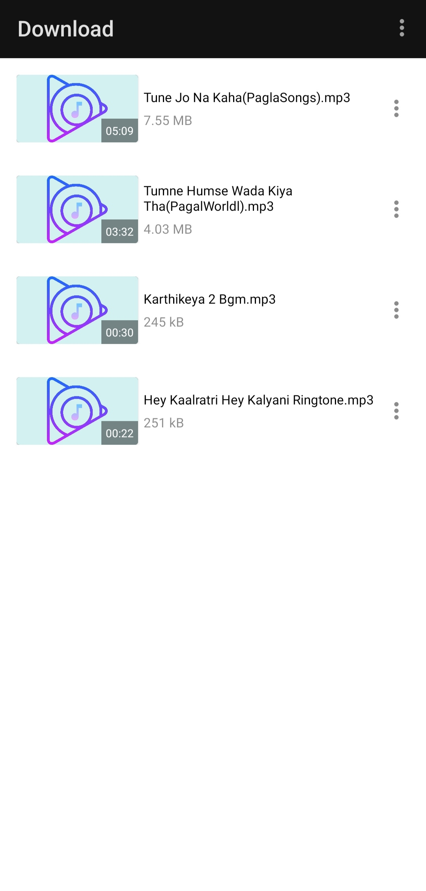
  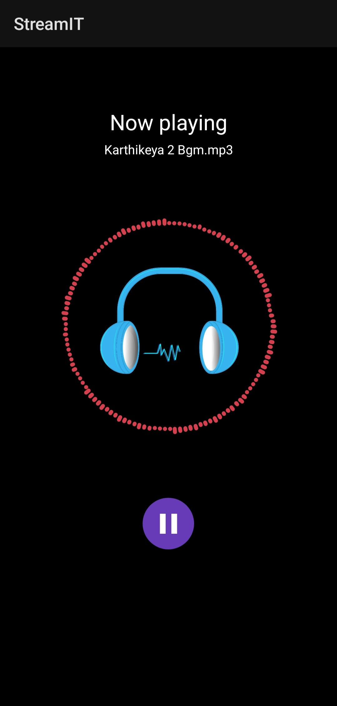

  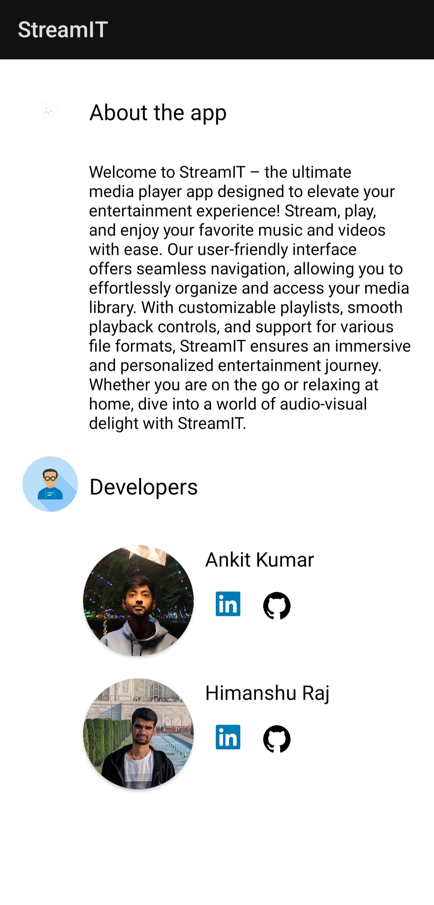
  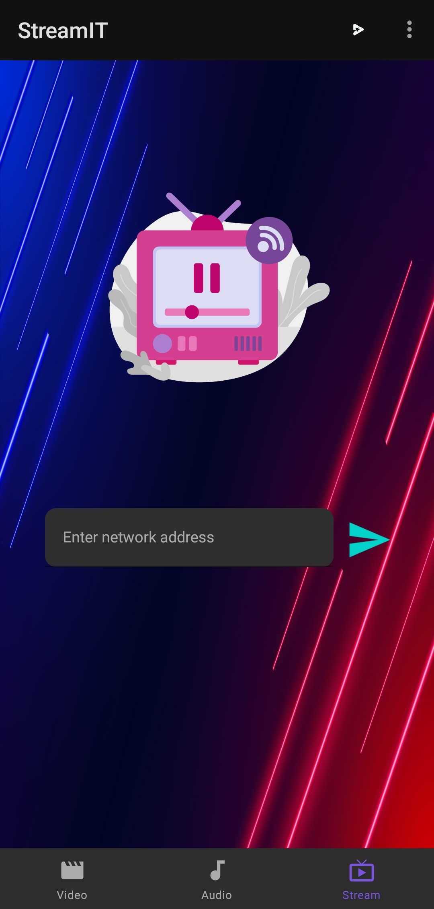
  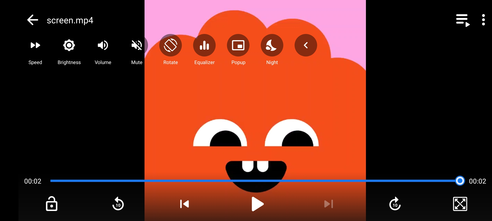

## 🛠️ Installation Step

- Download or clone the repo
- Build gradle and run the project

## 🖥️ Technologies Used

- Android Studio
- Java
- Exoplayer
- Lottie Animation
- Simple Media Player

## 😃 If you liked the app, Please give it a ⭐ and fork the repository. 🙌  
